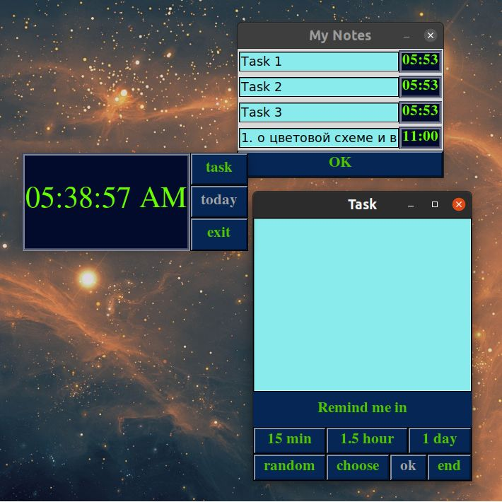

# Simple Reminder
Простая "open source" напоминалка для различных задач. Мною используется в основом в качестве повторения пройденного материала.
Код написан на python 3.10.0 с поддержкой аннотации типов. Т.о. возможна несовместимость с более ранними версиями.
### Demo


### Цветовая схема
По умолчанию стоит colorscheme со значением ***brown***. Но можно заменить на ***deep blue*** в файле конфигурации ***config.cfg***.



### Установка в Ubuntu
Создаем скрипт:
```
$ vi $HOME/Desktop/reminstall.sh
```
В нем сохраняем следующие строки:
~~~
#!/bin/bash
path_=$HOME/Apps    # use your path

mkdir $path_
git clone https://github.com/AtlanticP/reminder $path_/reminder
python3 -m venv $path_/reminder/.venv    # создание виртуального окружения
source $path_/reminder/.venv/bin/activate    # активация виртуального окружения
pip install --upgrade pip    # установка зависимостей
pip install -r $path_/reminder/requirements.txt
~~~
В домашней директории создается папка ***Apps***, в ней директория ***reminder***, в которую клонируются необходимые данные. Далее создается и активируется виртаульное окружение и устанавливаются зависимости.

Запускаем скрипт, превдарительно сделав его исполняемым:
```
$ sudo chmod +x $HOME/Descktop/reminstall.sh
$ source $HOME/Descktop/reminstall.sh
```
ЗАМЕЧАНИЕ: Если установка осуществляется вручную, то для запуска напоминалки необходимы два пакета, указанные в ***requirements.txt***: 
~~~
path_=$HOME/Apps    # use your path
pip install -r $path_/reminder/requirements.txt
~~~
### Запуск
~~~
path_=$HOME/Apps
source $path_/reminder/.venv/bin/activate
python $path_/reminder/main.py
~~~
В процессе запуска Simple Reminder создает в корневой папке ***nosql*** файл ***tasks.csv***, в котором сохраняются задачи.

### Автозапуск (пример в Ubuntu)
Создаем  файл ***reminder.desktop*** в папке автозагрузк с соответствующим расширением:
```
vi $HOME/.config/autostart/reminder.desktop
```
В нем прописываем следующую конфигурацию:
~~~
[Desktop Entry]
Type=Application
Name=Reminder
Exec=$HOME/Apps/reminder/autostart.sh
~~~
Сохраняеем изменения и создаем новый файл ***autostart.sh*** в корневой папке приложения:
```
$ vi $HOME/Apps/reminder/autostart.sh
```
Скрипт будет содежрать следующий код:
~~~
#!/bin/bash
path_=$HOME/Apps/reminder
$path_/.venv/bin/python $path_/main.py &
~~~
Делаем ***autostart.sh*** файл исполняемым:
```
$ sudo chmod +x $HOME/Apps/reminder/autostart.sh
```
### Файл конфигурации ***config.cfg***
По умолчанию создается файл конфигурации в корневой папке SimpleReminder. В нем пропиывается путь к файлу ***tasks.csv***, где сохраняются задачи. 
Также в этом файле можно изменить цветовую схему, указав:
```
scheme_name = deep blue
```
